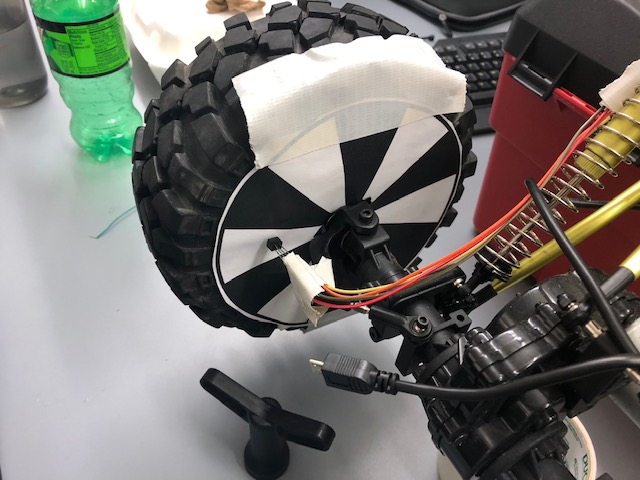

# Autonomous-RC-Car  
EC444 Group 12 Quest 4 - Autonomous RC Crawler using an ESP32 board and LIDAR sensors.  
Authors: Alex Fatyga, Justin Morgan, Nikhil Gupta

### Solution Design
Our solution uses UDP sockets and uses the esp32 as the server, receiving messages, and the web client as the client, transmitting messages. The web client uses socket io to send to the Javascript after a start or stop button has been pressed. After the start message has been sent, the esp starts the mcpwm set duty with the value 1300 so the wheels start moving at approximately 0.2 to 0.4 m/s. When the speed gets too big, the mcpwm set duty value is raised so the car slows down and when the speed is too slow, the mcpwm set duty is lowered so the car speeds up. We stop the mcpwm set duty value from getting too high that the car stops altogether. When the stop message is sent from the client to the esp, the mcpwm set duty is set to 1400 to indicate neutral and non moving.  
We maintain center of track by comparing the distances of the microlidars. If the microlidar on the right side has a bigger distance than the left, the crawler starts to slightly steer to the right and vice versa. We use a distance of about 25 cm to create as accurate a center of track as possible since there is about 5-10 cm from the sensor to the end of the wheel. If the difference is less than 25 cm, then the crawler steers center.  
To detect collision, we used the LidarLite and put it on the front of the crawler and set the detection at 25 cm (due to the distance between the front of the crawler and front of the wheels). When it reaches this threshold, the crawler comes to a stop.  
The microLidars are powered via the ESC 5 volt output since the 5 volt USB current output from the ESP32 is insufficient for powering all of our devices together. Both of the microLidars communicate with the ESP32 via UART, one through the TX RX pins, and the other through pins A0 and A1. The LidarLite and the pulse detector are powered via the 5 volt USB pin. The steering servo is powered by 3.3 volts from the ESP32 and is controlled via a 3.3 volt PWM signal that is stepped down from 5 volt logic via the H-Bridge. The ESC PWM signal is controlled by 3.3 volt logic from GPIO pin 12. The alphanumeric display is powered by 3.3 volts from the ESP32 and is connected via i2c on pins 14 and 15, while the LidarLite works via i2c as well on the SDA and SCL pins.  
Wheel speed is calculated by taking the time between pulses detected by the pulse detector. This time is then used to calculate the hypothetical seconds per rotation. Taking the inverse of this value (rotations per second) and multiplying by the meters per rotation (wheel circumference) gives us the wheel speed in meters per second.

### Images
Our wiring 

   
Our microlidar on the side of the crawler  

  
Our lidarlite on the front of the crawler  

   
The encoder pattern on the back wheel with the encoder attached  

   
Diagram of how the UDP connections work  

  
Diagram of how the crawler stays in the center of a path 

  
Diagram of how the speed is controlled  

  
Diagram of the tasks and what they do 

  
Our website to start and stop the crawler remotely  

  
Diagram of how the entire crawler is wired  

